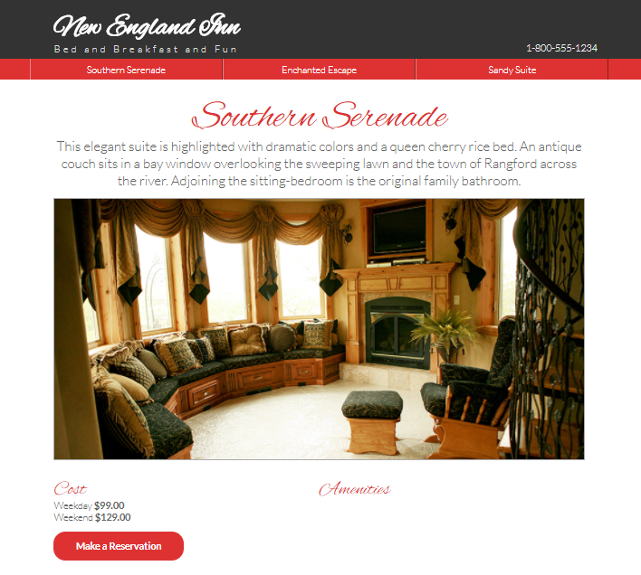

# Hospitality Site

In this project, we will build a hospitality website. We will learn how to load JSON data using AJAX and update the site content whenever user clicks on different room type links.

To run this project, clone this repo to your machine and run in your localhost environment. For my case, I have already install live-server npm and easily serve this demo website from same directory.

[View demo site here.](https://webdevtuts.github.io/hospitality_site/)

